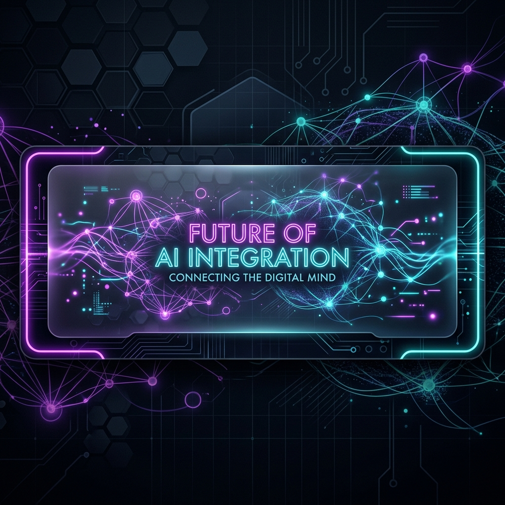

<p align="center">
  
</p>

# 🤖 AI Chatbot Suite: Integrated Product Ecosystem

<p align="center">
  <a href="https://nimish9010-real-time-genai-customer-service-bot-app-gelyzs.streamlit.app/">
    
  </a>
  
  
  
  
</p>

An enterprise-ready, high-performance RAG and cognitive analytics suite featuring **Conversational AI** and **Voice Intelligence** modules. Powered by a custom, high-density pure-Python SQLite vector database, natural language processing engines, and Google Gemini models.

👉 **[Click Here to Open the Live Web Application!](https://nimish9010-real-time-genai-customer-service-bot-app-gelyzs.streamlit.app/)**


---

## 🌌 Features & Product Lineup

### 💬 1. Conversational AI / WhatsApp Bot
Automates customer conversations, manages orders, and resolves inquiries.
- **WhatsApp Web Simulator**: High-fidelity green-header chat UI simulation.
- **RAG Ingestion**: Dynamic uploading of business FAQs or spreadsheets to a local vector store.
- **Structured Order Parsing**: Automated parsing of item details, quantities, and pricing into a simulated SQLite order registry database.

### ⭐ 2. Google Review Bot (Reputation Management)
Boosts and manages online business reputation on Google.
- **Sentiment Analytics**: Employs the VADER (Valence Aware Dictionary and sEntiment Reasoner) framework to analyze customer sentiment.
- **Automated Feedback Loop**: Drafts custom response templates dynamically using Gemini:
  - *Positive reviews (4-5 stars)*: Appreciative, brand-focused feedback responses.
  - *Negative reviews (1-2 stars)*: Apologetic, support-driven resolution replies.
- **Plotly Visual Dashboard**: Real-time review star distributions and sentiment polarity trends.

### 🎙️ 3. Voice Intelligence / VoiceBot
Interactive customer assistance for inbound sales and support calls.
- **Call Dialer & Screen**: Dial simulated leads with dynamic sound wave visual animations.
- **Real-Time Voice Integration**: Supports browser-native Speech-to-Text and Text-to-Speech synthesis for natural vocal dialogue.
- **Lead Classification**: Scores leads (Hot, Warm, Cold) using context extraction algorithms.

---

## 🖼️ Application Showcase

Here is a preview of the high-tech glassmorphic Command Center home dashboard:

<p align="center">
  
</p>

---

## 🛠️ Architecture & Technology Stack

- **Frontend**: [Streamlit](https://streamlit.io/) with a glassmorphic dark-theme custom CSS injection.
- **Core LLM Backend**: [Google Gemini Pro / Flash API](https://ai.google.dev/) for cognitive orchestration.
- **Embeddings Engine**: `models/gemini-embedding-001`.
- **Vector Database**: Custom high-speed **SQLite Vector Database** written in pure Python (performing exact Cosine Similarity matches).
- **Sentiment Analysis**: `vaderSentiment` for rule-based emotional classification.
- **Natural Language Parsing**: `spaCy` (en_core_web_sm) for Clinical Entity Recognizer / Name-Entity Extraction.

---

## 🚀 Installation & Local Setup

### 1. Prerequisites
Ensure Python 3.10+ is installed on your operating system.

### 2. Clone the Repository
```bash
git clone https://github.com/your-username/ai-chatbot-suite.git
cd ai-chatbot-suite
```

### 3. Create a Virtual Environment (Recommended)
```bash
python -m venv venv
# On Windows (PowerShell):
.\venv\Scripts\Activate.ps1
# On macOS/Linux:
source venv/bin/activate
```

### 4. Install Dependencies
```bash
pip install -r requirements.txt
```

### 5. Download the NLP Model
```bash
python -m spacy download en_core_web_sm
```

### 6. Environmental Configuration
Create a `.env` file in the root folder and add your Gemini API Key:
```env
GOOGLE_API_KEY=your_gemini_api_key_here
```

---

## 🖥️ Running the Application

Launch the Streamlit dashboard on your local machine:
```bash
streamlit run app.py
```
Open your browser and navigate to **`http://localhost:8501`** to access the command center dashboard.

---

## 📂 Project Structure

```
ai-chatbot-suite/
│
├── app.py                     # Main Command Center homepage (Glassmorphic dashboard)
├── config.py                  # Environment and collection path variables
├── requirements.txt           # Python library dependencies
├── architecture_diagram.png   # System topology blueprint
│
├── data/                      # Base datasets (JSON files for arXiv and MedQuAD)
│   ├── arxiv/
│   └── medical/
│
├── modules/                   # Core backend logics
│   ├── vector_store.py        # Custom SQLite-based vector similarity search engine
│   ├── knowledge_base.py      # Core RAG functions
│   └── ...
│
├── pages/                     # Streamlit application tabs
│   ├── 1_🧠_Knowledge_Base.py
│   ├── 2_🖼️_Multi_Modal.py
│   ├── ...
│   └── 6_🌍_Multilingual.py
│
└── utils/                     # Helper tools and UI components
    └── helpers.py
```

---

## 📜 License
This project is licensed under the MIT License.
